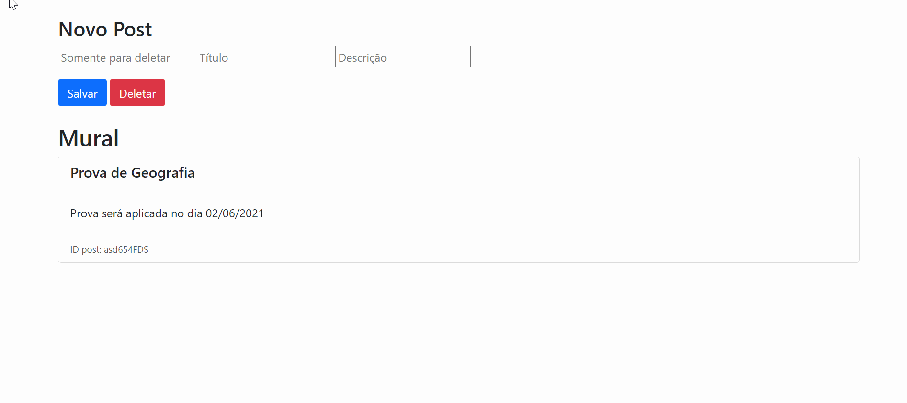

  
  

### - Olá comunidade! :D

### - Comecei a estudar Node.JS e seus principais pacotes. Neste exemplo pude aprender sobre o pacote Express do Node.

### - Este pacote nos ajuda a criar um servidor web e também auxilia em suas requisições: GET, PUT, POST, DELETE e etc.

### - Estou muito feliz, pois neste projeto pude pela primeira vez integrar o Front-End e o Back-End e entender de verdade como cada um funciona.
### - Nesta aplicação foram usados as seguintes tecnologias:

#### *HTML.
#### *CSS.
#### *JavaScript
#### *Bootstrap
#### *NodeJS

### Demonstração da aplicação:

### Gostou do meu projeto? :D Entre em contato comigo! 
[Linkedin](https://www.linkedin.com/in/lucas-rosa-058683102/)  
[Email: lucasmetron@gmail.com](mailto:lucasmetron@gmail.com)